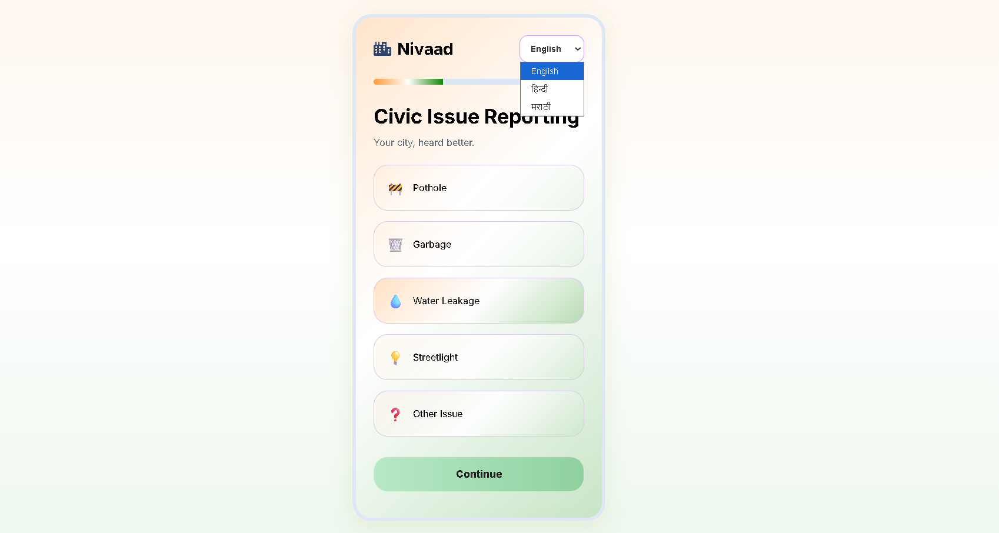
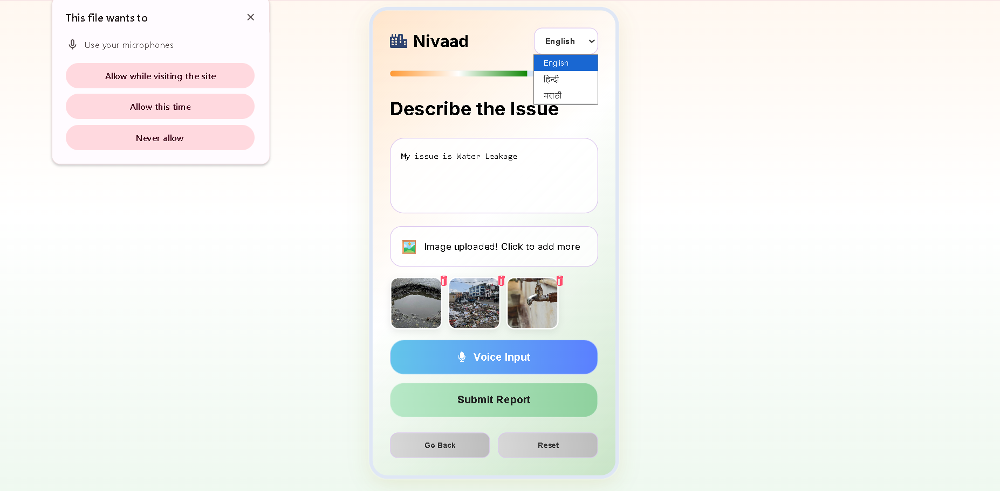
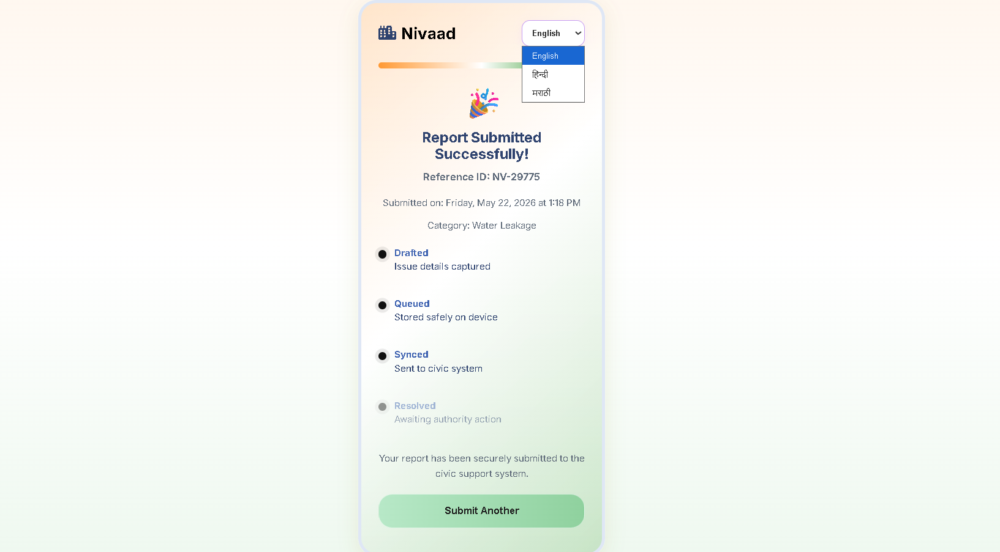

# Nivaad

This project was built as part of the Potens Frontend Internship Assignment 2026. Instead of building a generic reporting form, I wanted to create something that felt closer to a real civic-tech mobile application — a multilingual, installable, low-bandwidth-friendly Progressive Web App that allows users to report civic issues quickly and intuitively.

A multilingual civic issue reporting Progressive Web App (PWA) built for the Potens Frontend Internship Assignment 2026.

The application allows users to report civic problems through a clean mobile-first interface with multilingual support, voice input, image uploads, timeline-based confirmation tracking, and installable PWA functionality.

---

# Features

* Multilingual support (English, Hindi, Marathi)
* Mobile-first civic reporting interface
* Voice input using Web Speech API
* Multiple image uploads with preview support
* Individual image deletion support
* Installable Progressive Web App (PWA)
* Offline-ready architecture using Service Worker
* Timeline-style submission tracker
* LocalStorage persistence
* Slow-3G conscious lightweight design
* Thoughtful civic-style micro-interactions

---

# Tech Stack

| Component | Technology |
| ---------- | ---------- |
| Frontend UI | HTML5 |
| Styling | CSS3 |
| Logic | Vanilla JavaScript |
| Voice Input | Web Speech API |
| Persistence | LocalStorage |
| PWA Support | Manifest + Service Worker |

---

# Architecture Overview

```text
Screen 1 → Category Selection
        ↓
Screen 2 → Details + Voice + Upload
        ↓
Screen 3 → Confirmation + Timeline Tracker
        ↓
LocalStorage Persistence + PWA Installability
```

---

# Multilingual Support Strategy

One of the main requirements of the assignment was multilingual accessibility.

Instead of keeping translations limited to static labels, I designed the application so that important interface states also switch language dynamically.

The language toggle updates:
- category labels
- buttons
- placeholders
- upload states
- timeline statuses
- success messages

The goal was to make the interface feel naturally multilingual instead of partially translated.

The application currently supports:
1. English
2. Hindi
3. Marathi

---

# Voice Input Integration

The details screen supports voice-based issue descriptions using the Web Speech API.

Users can:
1. tap the microphone button
2. dictate issue details
3. automatically populate the text area

The interaction was intentionally designed to remain simple and accessible for mobile-first usage.

---

# Multiple Image Upload System

The application supports:
- uploading multiple images simultaneously
- continuously adding images one-by-one
- image preview rendering
- deleting individual uploaded images separately

A subtle upload-state micro-interaction was also implemented where the upload box temporarily changes state after successful image upload.

This was added to satisfy the assignment requirement of a thoughtful interaction that feels considered rather than playful.

---

# Timeline Status Tracker

The confirmation screen includes a civic-style status tracker with four stages:
- Drafted
- Queued
- Synced
- Resolved

The timeline UI was implemented as a stretch enhancement inspired by the optional status-tracker requirement in the assignment.

The intention was to make the submission confirmation feel closer to a real civic workflow system rather than a static success screen.

---

# PWA Implementation

The application includes:
- Manifest file
- Service Worker
- App icons
- Installable home-screen support
- Offline-ready structure

The application can be installed on supported mobile devices like a native application.

---

# Low-Bandwidth Design Decisions

One of the major focuses of the assignment was ensuring usability under Slow 3G conditions.

Instead of using heavy frontend frameworks, I intentionally chose lightweight technologies and minimal dependencies.

Design choices made for performance:
- Vanilla HTML/CSS/JavaScript
- Minimal external libraries
- Lightweight UI styling
- Simple gradients instead of large assets
- Minimal animations
- LocalStorage persistence
- No backend requests

The goal was stability and responsiveness on slower mobile networks.

---

# Design Decisions

Some of the major decisions while building this project:

* Chose Vanilla JavaScript instead of React to reduce bundle size and improve low-bandwidth performance.

* Focused heavily on mobile-first spacing and touch-friendly interactions.

* Used multilingual switching for all major interface states instead of only static labels.

* Added subtle civic-style gradients instead of flashy visual effects to preserve a calm and professional interface.

* Implemented timeline visualization to make the confirmation screen feel more system-oriented and realistic.

* Added upload-state micro-interactions to improve feedback without making the interface feel overly playful.

* Designed the UI to feel lightweight, modern, and installable rather than like a traditional web form.

---

# Screenshots

## Screen 1 — Category Selection



---

## Screen 2 — Details Screen



---

## Screen 3 — Confirmation Screen



---

# How to Run

## 1. Clone Repository

```bash
git clone <potens-intern-frontend-siya-dumale>
```

---

## 2. Open Project Folder

Open the folder in VS Code or any preferred editor.

---

## 3. Run Application

Run using:
- Live Server

OR

Open:

```text
index.html
```

directly in browser.

---

# Install as PWA

On supported browsers:

1. Open the deployed application
2. Click “Install App”
3. Add to Home Screen

---

# Project Structure

```text
potens-intern-frontend-siya-dumale/
│
├── index.html
├── style.css
├── script.js
├── manifest.json
├── service-worker.js
├── icon-192.png
├── icon-512.png
└── README.md
```

---

# What Works

* Multilingual switching
* Voice input
* Multiple image uploads
* Individual image deletion
* Installable PWA
* LocalStorage persistence
* Timeline status tracker
* Mobile responsiveness
* Offline-ready structure
* Reset and navigation functionality

---

# Limitations

* No real backend integration
* No live civic authority workflow
* Offline sync queue not fully implemented
* Image compression not implemented
* No push notifications
* No real geolocation integration

---

# Future Improvements

If I had more time, I would improve the project further by:

* implementing offline sync queue support

* adding image compression before upload

* improving accessibility auditing

* adding geolocation support

* implementing push notifications

* adding advanced caching strategies

* integrating real civic authority workflows

* improving offline-first support further

---

# AI Use Log

| Tool           | Approx Usage | Purpose                                                                                         |
| -------------- | ------------ | ----------------------------------------------------------------------------------------------- |
| ChatGPT        | Moderate        | Debugging, multilingual retrieval, UI improvements, contradiction analysis |
| GitHub Copilot | Minimal      | Small code suggestions    

---

# Assignment Alignment

This project satisfies:

* Three-screen mobile-first flow
* Multilingual UI support
* Voice input support
* Installable PWA support
* Local persistence
* Slow-3G conscious design
* Timeline tracker UI
* Thoughtful micro-interactions
* Mobile responsiveness

---

# Design Decisions

The assignment emphasized:

- taste
- judgment
- focused execution
- thoughtful UX
- honest tradeoffs

This project intentionally focused on:

- multilingual accessibility
- mobile-first usability
- installable experience
- low-bandwidth friendliness
- clean civic-tech interaction design

---

# Author

Siya Dumale
